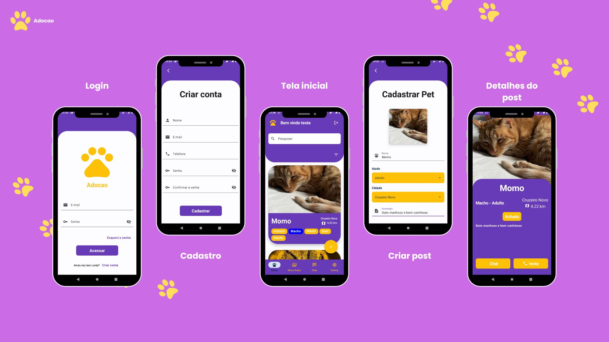
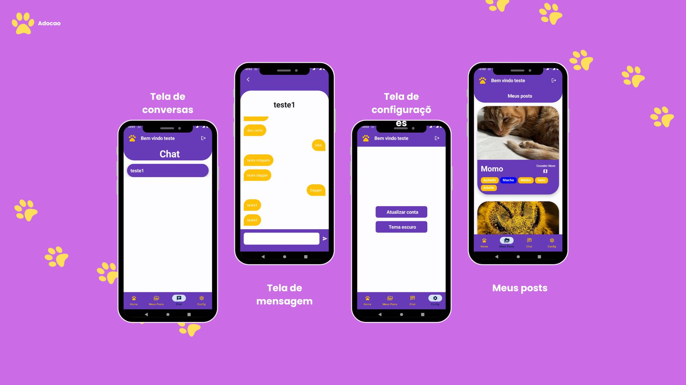

# Projeto Adocao

# Sobre o Projeto
O projeto é um aplicativo móvel
dedicado a reunir animais perdidos com seus
donos ou encontrar novos lares para eles. Os
usuários poderão criar contas, visualizar e
cadastrar anúncios de animais perdidos ou
disponíveis para adoção. O aplicativo possuirá
um chat integrado para facilitar a comunicação
entre os usuários e utilizará um sistema de
geolocalização para achar animais próximos
da localização dos usuários. O objetivo é
oferecer uma solução abrangente e acessível
para promover o bem-estar animal e a adoção
responsável.

## Tecnologias Utilizadas
### Back end
- Spring Boot
- MySql
- Docker

### Mobile
- Jetpack Compose
- DataStore
- Hilt Dagger
- Retrofit
- Extended Icons
- Location Services
- Coroutines
- Animated Navigation


# Layout Mobile
### Login / Criar Conta / Home / Criar Post / Detalhes Post

### Chat / Configuração / Meus Posts


## Técnicas e tecnologias utilizadas

### Spring Boot

A aplicação foi desenvolvida com o Spring Boot utilizando Java e foram utilizadas as seguintes técnicas:

- `Controllers`: mapear os endpoints
- `Services`: realizar as ações esperadas pelo controller
- `Repositories`: oferecer e realizar os comportamentos de persistência de banco de dados
- `DTO`: padrão para indicar quais informações devem ser enviada/recebidas via requisição
- `JPA` com `Hibernate`: solução para se comunicar com o banco de dados
- `Mysql`:  sistema de gerenciamento de banco de dados, que utiliza a linguagem SQL como interface.
- `Security`: tratamento e analise do Token
- `WebSocket com STOMP`: implementação para comunicação em tempo real. Utiliza o protocolo STOMP.

Bibliotecas do Spring Framework que foram utilizadas:

- `devtools`: ferramenta para agilizar o processo de desenvolvimento sem reiniciar a aplicação para atualizar
- `starter-web`: suporte para aplicação web em geral
- `starter-data-jpa`: suporte para abstrair a implementação de repositórios e reutilizar comportamentos de CRUD com base na configuração da JPA
- `starter-security`: sistemas de autenticação, autorização e proteção contra diferentes tipos de vulnerabilidades de aplicações web,também disponibiliza algoritmos de criptografias
- `starter-validation`: caso tenha algum problema com a nossa requisição, retorna o erro da requisição
- `spring-boot-starter-cache`: facilita o gerenciamento de cache, melhorando a performance do sistema.
- `mysql-connector-java`: conecta a aplicação ao banco de dados MySQL, usando SQL como interface.
- `jjwt`: biblioteca para criar e verificar tokens JWT, usados para autenticação e segurança.
- `flyway-core e flyway-mysql`: ferramentas de migração para gerenciar versões e alterações do banco de dados.
- `lombok`: automatiza a geração de código repetitivo, como getters, setters, construtores e outros, reduzindo boilerplate em Java.
- `spring-boot-starter-mail`: facilita o envio de e-mails diretamente pela aplicação.

### Jetpack Compose

A arquitetura do Jetpack Compose nesta aplicação é dividida em módulos organizados conforme as camadas de responsabilidade, buscando manter a aplicação modular e de fácil manutenção. As camadas principais e suas funções são:
- `Data`: Esta camada é responsável pela comunicação com a API, o armazenamento local e pela manipulação de recursos de localização do dispositivo. Todos os repositórios e fontes de dados, tanto locais quanto remotos, estão organizados nesta camada, oferecendo acesso centralizado aos dados da aplicação.
- `Domain`: Nesta camada, temos a lógica de negócios independente de frameworks específicos. Ela contém os UseCases, que encapsulam as regras de negócios da aplicação, os Models, que são representações dos dados, e a Interface Repository, que define contratos para as operações de dados. Essa camada interage diretamente com a Data, facilitando a separação das regras de negócio e permitindo fácil substituição ou alteração de fontes de dados.
- `Presentation`: A camada de apresentação organiza os elementos de UI, como ViewModels, que mantêm e gerenciam o estado da interface do usuário, as Screens, que são as telas individuais da aplicação, e os States, que definem o estado da interface do usuário em cada tela.
- `DI`: Esta camada gerencia as injeções de dependência usando o AppModule do Dagger Hilt. 
- `Navigation`: A camada de navegação organiza e gerencia a navegação entre telas.

Bibliotecas do Jetpack Compose que foram utilizadas:

- `datastore-preferences`: Biblioteca que oferece armazenamento de dados leve e eficiente.
- `dagger-Hilt`: Facilita a injeção de dependência no projeto.
- `coroutines`:  Permitem lidar com operações assíncronas de maneira eficiente no Android.
- `animated-nav-host`: Biblioteca que adiciona suporte a animações entre telas.
- `retrofit`: Biblioteca de cliente HTTP para consumir APIs REST de forma simplificada.
- `okhttp e logging-interceptor`: Oferecem controle sobre as solicitações de rede e permitem o monitoramento detalhado das requisições/respostas HTTP.
- `krossbow`: Biblioteca para comunicação em tempo real via protocolo STOMP sobre WebSocket
- `material-icons-extended`: Conjunto de ícones adicionais para o Jetpack Compose.
- `services-location`: Biblioteca de serviços de localização da Google Play Services, utilizada para acessar a localização do dispositivo.


## Endpoints para api
### Usuário
```bash
#Salvar usuário

Método: POST

endpoint: /usuario/save
#Request
{
    "nome":"",
    "senha":"",
    "email":"",
    "telefone":""
}

#Response
{
    "id":"",
    "nome":"",
    "senha":"",
    "email":"",
    "telefone":""
}
Status 201 - CREATED
```

```bash
#Ver todos os usuários

Método: GET

endpoint: /usuario/find-all

#Response
{
    "content": [
        {
            "id": "",
            "nome": "",
            "senha": "",
            "email": "",
            "telefone": ""
        }
    ],
    "pageable": {
        "sort": {
            "empty": false,
            "sorted": true,
            "unsorted": false
        },
        "offset": 0,
        "pageNumber": 0,
        "pageSize": 20,
        "paged": true,
        "unpaged": false
    },
    "totalPages": 5,
    "totalElements": 100,
    "last": false,
    "size": 20,
    "number": 0,
    "sort": {
        "empty": false,
        "sorted": true,
        "unsorted": false
    },
    "first": true,
    "numberOfElements": 20,
    "empty": false
}

Status 200 - OK
```

```bash
#Login

Método: POST

endpoint: /usuario/login
#Request
{
    "login":"",
    "senha":"",
}

#Response
{
    "token":"",
    "idUser":"",
    "nome":"",
}
Status 200 - OK
```

```bash
#Refresh token

Método: POST

endpoint: /usuario/refresh-token
#Request
{
    "token":"",
    "idUser":"",
    "nome":"",
}

#Response
{
    "token":"",
    "idUser":"",
    "nome":"",
}
Status 200 - OK
```

```bash
#Get dados usuário

Método: GET

endpoint: /usuario/get-user/{idUser}
#Request
{
    "token":"",
    "idUser":"",
    "nome":"",
}

#Response
{
    "token":"",
    "idUser":"",
    "nome":"",
}
Status 200 - OK
```

```bash
#Atualizar dados usuário

Método: PUT

endpoint: /usuario/update
#Request
{
    "id":"",
    "nome":"",
    "senha":"",
    "email":"",
    "telefone":""
}

#Response
{
    "id":"",
    "nome":"",
    "senha":"",
    "email":"",
    "telefone":""
}
Status 200 - OK
```

```bash
#Apagar dados usuário

Método: DELETE

endpoint: /usuario/delete-user/{idUsuario}
#Request

#Response

Status 200 - OK
```

```bash
#Enviar email com código para resetar a senha

Método: POST

endpoint: /usuario/reset-senha/{email}
#Request

#Response

Status 200 - OK
```

```bash
#Verificar código para atualizar a senha

Método: POST

endpoint: /usuario/verificar-cod
#Request
{
    "cod":0
    "email":""
}
#Response

Status 200 - OK
```

```bash
#Atualizar senha

Método: PUT

endpoint: /usuario/alterar-senha
#Request
{
    "email":"",
    "senha":"",
    "cod":0
}
#Response

Status 200 - OK
```

```bash
#Achar usuário pelo senderId

Método: GET

endpoint: /usuario/get-users-by-sender-id/{idUser}
#Request
{
    [{
    "id":"",
    "nome":"",
    "senha":"",
    "email":"",
    "telefone":""
    }]
}
#Response

Status 200 - OK
```

### Pets
```bash
#Get All posts

Método: GET

endpoint: /pet
parâmetros:{
  page:0,
  search:"",
  orderBy:"",
  qtd:"",
  isDog:false,
  isCat:false,
  isAchado:false,
  isAdotar:false,
  isPerdido:false,
  isGrande:false,
  isMedio:false,
  isPequeno:false,
  isMacho:false,
  isFemea:false,
  isFilhote:false,
  isAdulto:false,  
  isIdoso:false,    
}
  
#Request

#Response
{
    "content": [
        {
            "id": "",
            "nome": "",
            "idade": "ADULTO",
            "localizacao": "NUCLEO_BANDEIRANTE",
            "lat": 0.0,
            "long": 0.0,
            "usuario": {
              "id":"",
              "nome":"",
              "senha":"",
              "email":"",
              "telefone":""
            },
            "descricao": "",
            "genero": "FEMEA",
            "dataPublicacao": "2024-10-29",
            "foto": "",
            "status": "ACHADO",
            "tipoAnimal": "CACHORRO",
            "tamanho": "MEDIO",
            "donoId": ""
        }
    ],
    "pageable": {
        "sort": {
            "empty": false,
            "sorted": true,
            "unsorted": false
        },
        "offset": 0,
        "pageNumber": 0,
        "pageSize": 5,
        "paged": true,
        "unpaged": false
    },
    "totalPages": 3,
    "totalElements": 15,
    "last": false,
    "size": 5,
    "number": 0,
    "sort": {
        "empty": false,
        "sorted": true,
        "unsorted": false
    },
    "first": true,
    "numberOfElements": 5,
    "empty": false
}

Status 200 - OK
```

```bash
#Localizar pets por usuário

Método: GET

endpoint: /pet/user/{userId}
parâmetros:{
  page:0,
  orderBy:"",
  qtd:"",
}
#Request
{
    "content": [
        {
            "id": "",
            "nome": "",
            "idade": "ADULTO",
            "localizacao": "NUCLEO_BANDEIRANTE",
            "lat": 0.0,
            "long": 0.0,
            "usuario": {
              "id":"",
              "nome":"",
              "senha":"",
              "email":"",
              "telefone":""
            },
            "descricao": "",
            "genero": "FEMEA",
            "dataPublicacao": "2024-10-29",
            "foto": "",
            "status": "ACHADO",
            "tipoAnimal": "CACHORRO",
            "tamanho": "MEDIO",
            "donoId": ""
        }
    ],
    "pageable": {
        "sort": {
            "empty": false,
            "sorted": true,
            "unsorted": false
        },
        "offset": 0,
        "pageNumber": 0,
        "pageSize": 5,
        "paged": true,
        "unpaged": false
    },
    "totalPages": 3,
    "totalElements": 15,
    "last": false,
    "size": 5,
    "number": 0,
    "sort": {
        "empty": false,
        "sorted": true,
        "unsorted": false
    },
    "first": true,
    "numberOfElements": 5,
    "empty": false
}
#Response

Status 200 - OK
```

```bash
#Localizar pet por id

Método: GET

endpoint: /pet/{petId}
#Request

#Response
{
    "id": "",
    "nome": "",
    "idade": "ADULTO",
    "localizacao": "NUCLEO_BANDEIRANTE",
    "lat": 0.0,
    "long": 0.0,
    "usuario": {
      "id":"",
      "nome":"",
      "senha":"",
      "email":"",
      "telefone":""
    },
    "descricao": "",
    "genero": "FEMEA",
    "dataPublicacao": "2024-10-29",
    "foto": "",
    "status": "ACHADO",
    "tipoAnimal": "CACHORRO",
    "tamanho": "MEDIO",
    "donoId": ""
}
Status 200 - OK
```

```bash
#Salvar pet

Método: POST

endpoint: /pet
#Request
{
    "nome": "",
    "idade": "ADULTO",
    "localizacao": "NUCLEO_BANDEIRANTE",
    "lat": 0.0,
    "long": 0.0,
    "descricao": "",
    "genero": "FEMEA",
    "dataPublicacao": "2024-10-29",
    "foto": "",
    "status": "ACHADO",
    "tipoAnimal": "CACHORRO",
    "tamanho": "MEDIO",
    "donoId": ""
}
#Response
{
    "id": "",
    "nome": "",
    "idade": "ADULTO",
    "localizacao": "NUCLEO_BANDEIRANTE",
    "lat": 0.0,
    "long": 0.0,
    "usuario": {
      "id":"",
      "nome":"",
      "senha":"",
      "email":"",
      "telefone":""
    },
    "descricao": "",
    "genero": "FEMEA",
    "dataPublicacao": "2024-10-29",
    "foto": "",
    "status": "ACHADO",
    "tipoAnimal": "CACHORRO",
    "tamanho": "MEDIO",
    "donoId": ""
}
Status 200 - OK
```

```bash
#Atualizar pet

Método: PUT

endpoint: /pet
#Request
{
    "id":""
    "nome": "",
    "idade": "ADULTO",
    "localizacao": "NUCLEO_BANDEIRANTE",
    "lat": 0.0,
    "long": 0.0,
    "descricao": "",
    "genero": "FEMEA",
    "dataPublicacao": "2024-10-29",
    "foto": "",
    "status": "ACHADO",
    "tipoAnimal": "CACHORRO",
    "tamanho": "MEDIO",
    "donoId": ""
}
#Response
{
    "id": "",
    "nome": "",
    "idade": "ADULTO",
    "localizacao": "NUCLEO_BANDEIRANTE",
    "lat": 0.0,
    "long": 0.0,
    "usuario": {
      "id":"",
      "nome":"",
      "senha":"",
      "email":"",
      "telefone":""
    },
    "descricao": "",
    "genero": "FEMEA",
    "dataPublicacao": "2024-10-29",
    "foto": "",
    "status": "ACHADO",
    "tipoAnimal": "CACHORRO",
    "tamanho": "MEDIO",
    "donoId": ""
}
Status 200 - OK
```

```bash
#Apagar pet

Método: DELETE

endpoint: /pet/{petId}
#Request

#Response

Status 200 - OK
```

### Chat
```bash
#Receber mensagens

canal: /user/{userId}/queue/messages
#Receive
{
    "id":"",
    "senderId":"",
    "recipientId":"",
    "content":"",
}
```

```bash
#Enviar mensagem

canal: /app/chat
#Send
{
    "senderId":"",
    "recipientId":"",
    "content":"",
    "timestamp":"",
}

```